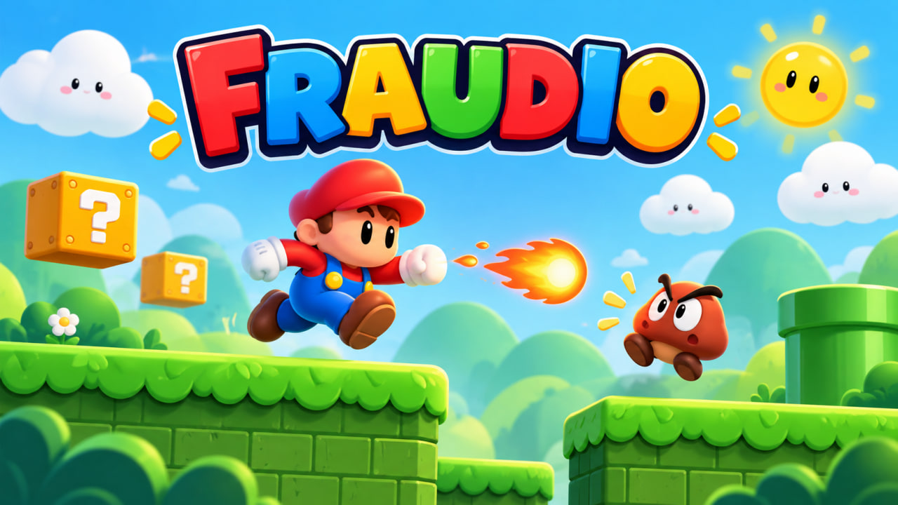
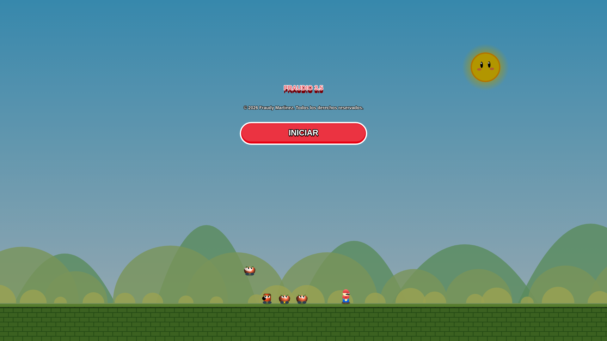
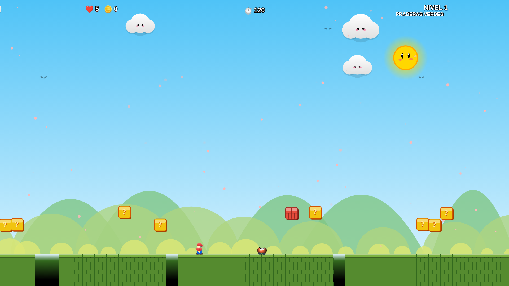
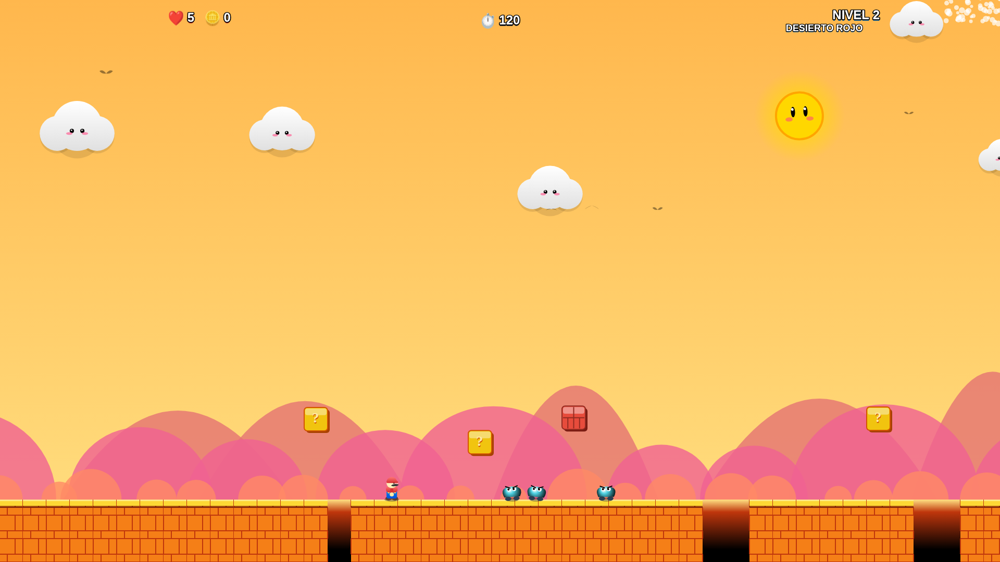
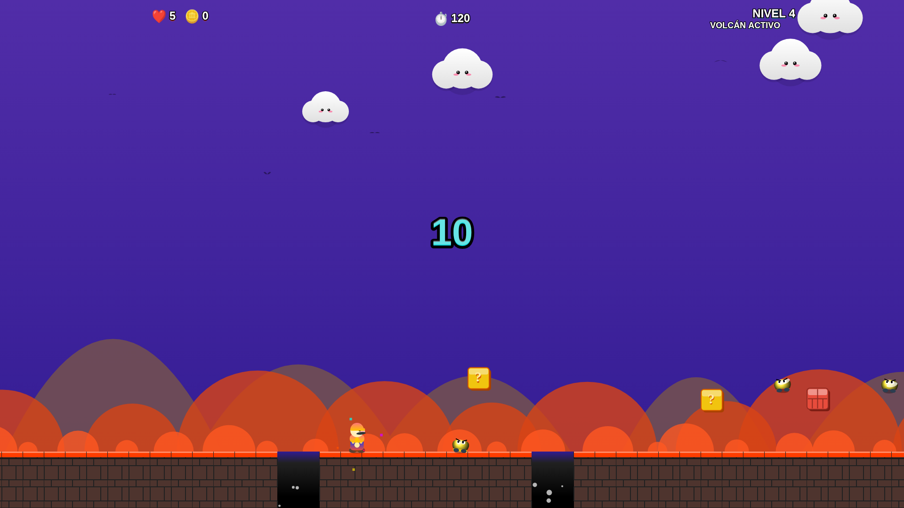
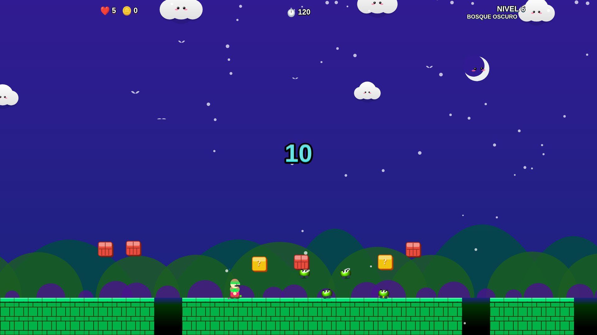
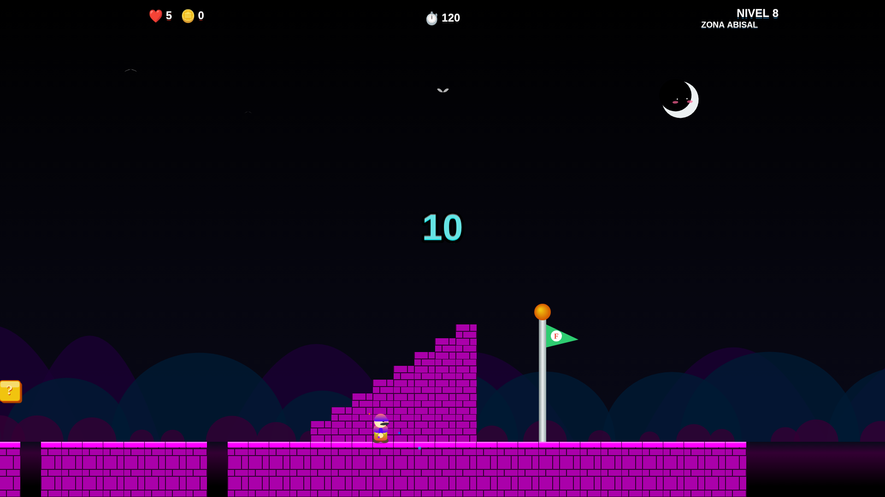

# FRAUDIO 3.5

  

  <strong>Plataformas 2D · 8 mundos · 3 dificultades · Web + Windows</strong> 
  <strong>2D platformer · 8 worlds · 3 difficulty levels · Web + Windows</strong>

  <a href="https://yottomtnz.github.io/Fraudio/assets/Fraudio.html">🎮 Jugar online / Play online</a>
  ·
  <a href="https://drive.google.com/file/d/1jdvcG4zopbD2GGHgoNobpl4mSlhO-CUM/view?usp=drive_link">⬇️ Descargar / Download</a>
  ·
  <a href="https://yottomtnz.github.io/Fraudio/">🌐 Sitio oficial / Official site</a>

---

## Español

**Fraudio** es un juego de plataformas 2D de acción creado por **Fraudy Martinez Madruga**. La versión actual, **3.5**, propone ocho mundos con estilos visuales diferenciados, tres niveles de dificultad, enemigos variados, bloques, monedas, power-ups, música propia por escenario y controles para escritorio y móvil.

### Estado actual de la versión 3.5

- **8 mundos:** Praderas Verdes, Desierto Rojo, Cumbres Nevadas, Volcán Activo, Playa Cristal, Bosque Oscuro, Cielo Azul y Zona Abisal.
- **3 dificultades:** Relajado, Normal y Difícil.
- **Música propia por mundo**, con variaciones de mayor tensión durante los últimos 30 segundos.
- **Power-ups visibles durante la partida**, incluyendo mejoras de tamaño, habilidades temporales y proyectiles.
- **Enemigos con comportamientos diferentes** a medida que avanza el juego.
- **Parallax, partículas, animaciones y efectos ambientales** para diferenciar cada zona.
- **Controles de teclado y controles táctiles integrados** en la versión web.
- **Pantallas de inicio, final, Game Over y celebración de nivel completado** integradas en la experiencia.
- **5 vidas por partida** y objetivo de llegar a la bandera antes de que termine el tiempo.

### 🎮 Controles — versión web

| Acción | Teclado |
|---|---|
| Moverse | `←` `→` o `A` `D` |
| Saltar | `↑`, `W` o `Espacio` |
| Disparar con la mejora correspondiente | `Shift` o `X` |
| Móvil | Botones táctiles mostrados dentro del juego |

### 📸 Capturas reales

  
  

  
  

  
  

### ▶️ Tráiler

El repositorio incluye el tráiler oficial en `assets/trailer/Trailer_Fraudio_1080p60.mp4`. También puede reproducirse directamente desde el [sitio oficial](https://yottomtnz.github.io/Fraudio/).

### 🖥️ Versión descargable para Windows

La ficha técnica actual indica compatibilidad con **Windows 7 SP1, Windows 10 y Windows 11**. Los requisitos completos están en [`docs/FICHA_TECNICA.md`](docs/FICHA_TECNICA.md).

### 🧰 Tecnología

La versión online está construida con **HTML5 Canvas, JavaScript y Web Audio/HTML5 Audio**, sin depender de un motor de juego externo para ejecutarse en el navegador.

### 👤 Autor y derechos

**Autor / Creador:** Fraudy Martinez Madruga  
**Copyright:** © 2026 Fraudy Martinez Madruga. Todos los derechos reservados.

La publicación del código y los archivos en este repositorio no concede permiso para redistribuir, vender, relicenciar, atribuirse la autoría ni crear versiones derivadas fuera de lo permitido por la legislación aplicable y los términos de GitHub. Consulte [`LICENSE`](LICENSE).

---

## English

**Fraudio** is a 2D action platformer created by **Fraudy Martinez Madruga**. The current **3.5** release features eight visually distinct worlds, three difficulty levels, varied enemies, blocks, coins, power-ups, stage-specific music, and controls for desktop and mobile play.

### Current 3.5 build

- **8 worlds:** Green Meadows, Red Desert, Snowy Peaks, Active Volcano, Crystal Beach, Dark Forest, Blue Sky, and Abyssal Zone.
- **3 difficulty levels:** Relaxed, Normal, and Hard.
- **Stage-specific music**, with higher-intensity variations during the final 30 seconds.
- **Visible in-game power-ups**, including size upgrades, temporary abilities, and projectiles.
- **Enemy behaviors that change and expand** as the game progresses.
- **Parallax, particles, animation, and environmental effects** to give each area its own identity.
- **Keyboard controls and built-in touch controls** in the web version.
- **Start, ending, Game Over, and level-complete celebration screens** integrated into the experience.
- **5 lives per run**, with the goal of reaching the flag before time expires.

### 🎮 Controls — web version

| Action | Keyboard |
|---|---|
| Move | `←` `→` or `A` `D` |
| Jump | `↑`, `W`, or `Space` |
| Shoot with the matching upgrade | `Shift` or `X` |
| Mobile | Touch buttons displayed inside the game |

### 📸 Real screenshots

  
  

  
  

  
  

### ▶️ Trailer

The official trailer is included at `assets/trailer/Trailer_Fraudio_1080p60.mp4` and can also be watched directly on the [official site](https://yottomtnz.github.io/Fraudio/).

### 🖥️ Downloadable Windows version

The current technical sheet lists support for **Windows 7 SP1, Windows 10, and Windows 11**. Full requirements are available in [`docs/FICHA_TECNICA.md`](docs/FICHA_TECNICA.md).

### 🧰 Technology

The online version uses **HTML5 Canvas, JavaScript, and Web Audio/HTML5 Audio**, with no external game engine required to run in the browser.

### 👤 Author and rights

**Author / Creator:** Fraudy Martinez Madruga  
**Copyright:** © 2026 Fraudy Martinez Madruga. All rights reserved.

Publishing the code and files in this repository does not grant permission to redistribute, sell, relicense, claim authorship, or create derivative versions except where allowed by applicable law and GitHub's terms. See [`LICENSE`](LICENSE).
